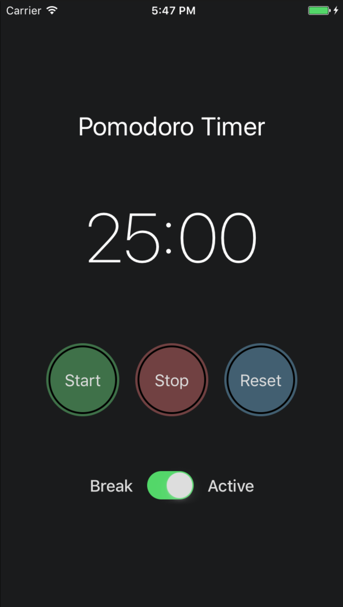

## Pomodoro Timer

⏰ My first app trying out mobile development using React Native.

See it in action at https://exp.host/@nichanank/pomodoro-tasks-app

## Features
- Displays minutes and seconds
- Timer count down seconds until it reaches 00:00
- Phone buzzes when timer reaches 0
- Timer can switch between break and work mode (5 and 25 minute timers respectively)
- Start, stop, reset functionality

### Todos
- Allow the user to input any arbitrary time for the timers (e.g. 5 mins of work time and 5 mins of break)
- Allow logging and task details input
- Analytics
